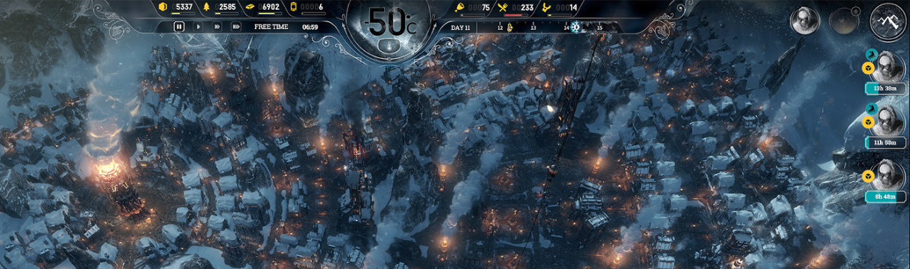

# northwind-frostpunk
a tutorial exploring golang, the northwind database, and the post apocalypse 

This tutorial is geared towards Mac users.

why am I making this? I've become familar with the Northwind database to teach SQL but I thought many of the tutorials I went through to be crudely designed and I simply desired something that would encourage me to explore and expand upon it. 

I also wanted to work on Golang again since the last app I built was several months ago and it feels like I've forgotten all the syntax. Fortunately, building software is like riding bike! Even if it is a bit rickety at the start...



## Day 1 Overview

1. setup and connect to postgres
2. learn a bit of golang 
3. connect golang to postgres
4. explore the database and learn about CTEs
5. play with the data & time inspired by [Frostpunk](https://en.wikipedia.org/wiki/Frostpunk)!

## PostgreSQL 

[northwind_psql](https://github.com/pthom/northwind_psql) is a github repo that sets up Postgres with a docker container. 

In addition to its readme, I would add that the following guide post that once the docker is up and finishes installing the database, open another another terminal window and test the conection.  

```
docker-compose exec db psql -U postgres -d northwind
```

After you've tested the connection, you can also try to connect with a tool like [pgAdmin4](https://www.pgadmin.org/) or [DBeaver](https://dbeaver.io/); they are both excellent! 

#### Connection 

```
host: localhost
username: postgres 
password: postgres 
dname: northwind 
port: 55432 
```

Initialy, I found it challenging to connect to the database running in its docker and this is connection details that I ended up using by trial and error.

## Golang

I followed this golang [getting-started](https://go.dev/doc/tutorial/getting-started) tutorial as a refresher since I hadn't touched golang in several months.

Next, after I was to output some pithy text and learned the `go mod tidy` command, I tackled this [go and postgres](https://www.calhoun.io/connecting-to-a-postgresql-database-with-gos-database-sql-package/) tutorial. 

As I already wrestled the postgres setup, the code provided in the tutorial worked right away. Now, I wanted to import my own function into my main project so I could log a pithy quote. I reviewed the [go mod](https://go.dev/doc/tutorial/create-module) tutorial and converted my original hello.go script into a function that I could import.  

-- Sept 21/2022 -- 

Day 1 took me about 4 hours in 2 sessions

As I accomplished the first 3 steps in my plan, I think I'll needed a couple more hours to put the finishing touches on this guided tutorial. I still need to:

4. explore the database and learn about CTEs
5. play with the data & time inspired by [Frostpunk](https://en.wikipedia.org/wiki/

Anyways, I'm happy with this progress

[as the hours pass...](https://www.youtube.com/watch?v=RQBDSciMe8c)

## Day 2 Survive the night! 

coming soon


