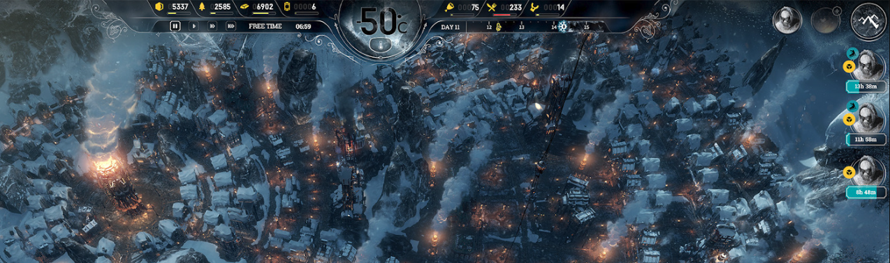
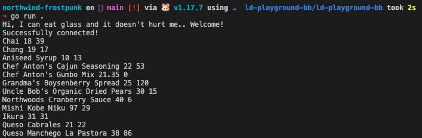
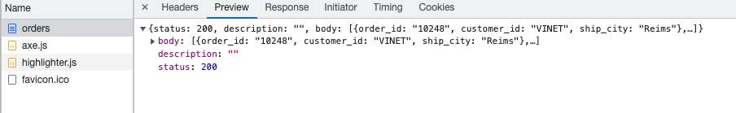

# northwind-frostpunk
a tutorial exploring golang, the northwind database, and the post apocalypse 

This tutorial is geared towards Mac users.

why am I making this? I've become familar with the Northwind database to teach SQL but I thought many of the tutorials I went through to be crudely designed and I simply desired something that would encourage me to explore and expand upon it. 

I also wanted to work on Golang again since the last app, Tank. I built Tank (think aquarium) to produce a daily report (crontab) looking at our feeds folder and would look into a dozen third-party feed folders. It woud count the incoming, proceeded and error files and attempt to raise an insight or call to action. Since it's been several months since I last touched it, it feels like I've forgotten all the syntax. Fortunately, building software is like riding bike! Even if it is a bit rickety at the start...



## Day 1 Overview

1. setup and connect to postgres
2. learn a bit of golang 
3. connect golang to postgres
4. explore the database and learn about CTEs
5. play with the data & time inspired by [Frostpunk](https://en.wikipedia.org/wiki/Frostpunk)!

## PostgreSQL 

[northwind_psql](https://github.com/pthom/northwind_psql) is a github repo that sets up Postgres with a docker container. 

In addition to its readme, I would add that the following guide post that once the docker is up and finishes installing the database, open another another terminal window and test the conection.  

```
docker-compose exec db psql -U postgres -d northwind
```

After you've tested the connection, you can also try to connect with a tool like [pgAdmin4](https://www.pgadmin.org/) or [DBeaver](https://dbeaver.io/); they are both excellent! 

#### Connection 

```
host: localhost
username: postgres 
password: postgres 
dname: northwind 
port: 55432 
```

Initialy, I found it challenging to connect to the database running in its docker and this is connection details that I ended up using by trial and error.

## Golang

I followed this golang [getting-started](https://go.dev/doc/tutorial/getting-started) tutorial as a refresher since I hadn't touched golang in several months.

Next, after I was to output some pithy text and learned the `go mod tidy` command, I tackled this [go and postgres](https://www.calhoun.io/connecting-to-a-postgresql-database-with-gos-database-sql-package/) tutorial. 

As I already wrestled the postgres setup, the code provided in the tutorial worked right away. Now, I wanted to import my own function into my main project so I could log a pithy quote. I reviewed the [go mod](https://go.dev/doc/tutorial/create-module) tutorial and converted my original hello.go script into a function that I could import.  

#### Log 🚀

-- Sept 21/2022 -- 

Day 1 took me about 4 hours in 2 sessions

As I accomplished the first 3 steps in my plan, I think I'll needed a couple more hours to put the finishing touches on this guided tutorial. I still need to:

4. explore the database and learn about CTEs
5. play with the data & time inspired by [Frostpunk](https://en.wikipedia.org/wiki/

Anyways, I'm happy with this progress [as the hours pass...](https://www.youtube.com/watch?v=RQBDSciMe8c)

## Day 2 Survive the night! 


A database mapped out in [UML](https://www.microsoft.com/en-ca/microsoft-365/business-insights-ideas/resources/guide-to-uml-diagramming-and-database-modeling) is an adventure for your eyes. 

Let's begin day 2 will pulling a few examples from this [Products Table Exercises](https://www.w3resource.com/mysql-exercises/northwind/products-table-exercises/) tutorial. 

I like how this author has included a [relational algebra](https://www.javatpoint.com/dbms-relational-algebra) tree diagram. 


I'm not the alone in this desire to [learn SQL](https://sqlbolt.com/) and [master its style](https://www.sqlstyle.guide/). Musili Adebayo has prepared an excellent [50 query guide](https://musiliadebayo.medium.com/50-sql-practice-queries-and-answers-3fc896650b2e).  

Over on stackoverflow, this user asks for [more](https://stackoverflow.com/questions/1065652/looking-for-exercises-to-learn-sql-using-the-northwind-database). 

https://itnext.io/go-tutorial-database-queries-on-go-with-postgresql-part-iii-c8907729c2f

4. Write a query to get most expense and least expensive Product list (name and unit price).

```
SELECT product_name, unit_price 
FROM products 
ORDER BY unit_price DESC;
```

6. Write a query to get Product list (id, name, unit price) where products cost between $15 and $25.

```
SELECT product_name, unit_price
FROM products
WHERE (((unit_price)>=15 And (unit_price)<=25) 
AND ((products.discontinued)=1))
ORDER BY products.unit_price DESC;
```

9. Write a query to count current and discontinued products.

One of favourite queries is the ability to simply count and roll up records. The Count function is the beginning of your data aggregation journey! 

```
SELECT Count(product_name)
FROM products
GROUP BY discontinued;
```

When dealing with physical products, there is a real sense of scarcity since products may go out of stock. We can't sell what we don't have.

10. Write a query to get Product list (name, units on order , units in stock) of stock is less than the quantity on order.
```
SELECT product_name,  units_on_order, units_in_stock
FROM products
WHERE (((discontinued)=0) AND ((units_in_stock)<units_on_order));
```
Next, I looked at this tutorial [Northwind Queries Part 1](https://www.geeksengine.com/database/problem-solving/northwind-queries-part-1.php) from Geeks Engine 


4. This is a rather simple query to get an alphabetical list of products.

```
SELECT DISTINCT b.*, a.category_name
FROM categories a 
INNER JOIN products b on a.category_id = b.category_id
WHERE b.discontinued = 0
ORDER BY b.product_name;
```

11. Products Above Average Price

This query shows how to use sub-query to get a single value (average unit price) that can be used in the outer-query.

```
SELECT DISTINCT product_name, unit_price
FROM products
WHERE unit_price > (SELECT AVG(unit_price) FROM products)
ORDER BY unit_price;
```

14. Quarterly Orders by Product

This query shows how to convert order dates to the corresponding quarters. It also demonstrates how SUM function is used together with CASE statement to get sales for each quarter, where quarters are converted from OrderDate column.

```
SELECT a.product_name, 
    d.company_name, 
    EXTRACT(YEAR FROM CAST(c.order_date AS DATE)) as order_year,
    (sum(case EXTRACT (QUARTER FROM c.order_date) when '1' 
        then b.unit_price*b.quantity*(1-b.discount) else 0 end), 0) "Qtr 1",
    (sum(case EXTRACT (QUARTER FROM c.order_date) when '2' 
        then b.unit_price*b.quantity*(1-b.discount) else 0 end), 0) "Qtr 2",
    (sum(case EXTRACT (QUARTER FROM c.order_date) when '3' 
        then b.unit_price*b.quantity*(1-b.discount) else 0 end), 0) "Qtr 3",
    (sum(case EXTRACT (QUARTER FROM c.order_date) when '4' 
        then b.unit_price*b.quantity*(1-b.discount) else 0 end), 0) "Qtr 4" 
from products a 
inner join order_details b on a.product_id = b.product_id
inner join orders c on c.order_id = b.order_id
inner join customers d on d.customer_id = c.customer_id 
where c.order_date between date('1997-01-01') and date('1997-12-31')
group by a.product_name, 
    d.company_name, 
    EXTRACT(YEAR FROM CAST(c.order_date AS DATE))
order by a.product_name, d.company_name;
```
There is stretch goal that I need to look since the formatting of the numbers looks funny. 

I know that I need to use either `char_at` or the `FORMAT` function to improve it.  

Searching for more sources of northwind practice, I stumbled across [this github repo](https://github.com/emnasc/northwind-sql-practice) by 
Emanoel Nascimento where the challenge became can I create the questions if I had solutions! 

I grabbed a few of his examples from the [sql](https://github.com/emnasc/northwind-sql-practice/blob/master/sql-practice-execises.sql) he provided. 

20.
``` 
 SELECT  C.category_name
       ,COUNT(P.category_id) AS total_products
  FROM categories AS C
  JOIN products AS P
    ON P.category_id = C.category_id
 GROUP BY C.category_name
 ORDER BY total_products DESC;
```
29.
```
SELECT  ORD.employee_id
       ,EMP.last_name
	   ,ODE.order_id
	   ,PRO.product_name
	   ,ODE.quantity
  FROM order_details AS ODE
  JOIN orders AS ORD
    ON ORD.order_id = ODE.order_id
  JOIN employees AS EMP
    ON ORD.employee_id = EMP.employee_id
  JOIN products AS PRO
    ON PRO.product_id = ODE.product_id
 ORDER BY ODE.order_id ASC; 
```
30.

```
SELECT  C.customer_id AS customer_customer_id
	   ,O.customer_id AS orders_customer_id
  FROM customers AS C
  LEFT JOIN orders AS O
	ON C.customer_id = O.customer_id
 WHERE O.customer_id IS NULL;
```
What happens if we want the customer to not be null?
```
SELECT  C.customer_id AS customer_customer_id
	   ,O.customer_id AS orders_customer_id
  FROM customers AS C
  LEFT JOIN orders AS O
	ON C.customer_id = O.customer_id
 WHERE O.customer_id IS NOT NULL;
```

While it is possible to [add the images](http://www.geeksengine.com/article/export-access-to-mysql-5.html) or even have [AI generate them](https://generated.photos/), since this geared towards a text-based adventure they are not necessary and rather poor photography anyways. Perhaps, an AI 

## Frostpunk

Besides [3 minute chess](https://lichess.org/) or [Wordle](https://www.nytimes.com/games/wordle/index.html), I haven't played a serious computer game since I gave up Starcraft 2 a few years ago. I wanted forever it seems to finally play Frostpunk which is [now 75% off](https://store.steampowered.com/agecheck/app/323190/) on steam.

#### Hope

```
CREATE TABLE employee_hope
(
  employee_id integer NOT NULL,
  hope integer NOT NULL,
  hunger integer NOT NULL,
  drive integer NOT NULL,
  grant_date timestamp default current_timestamp,
  CONSTRAINT employee_hope_id_fkey FOREIGN KEY (employee_id)
      REFERENCES employee (employee_id) MATCH SIMPLE
      ON UPDATE NO ACTION ON DELETE NO ACTION,
  created_at timestamp default current_timestamp,
  updated_at timestamp default current_timestamp
);
```

#### Profession 

```
CREATE TABLE profession(
  profession_id serial primary key,
  profession_name varchar(255) UNIQUE NOT NULL,
  profession_salary integer NOT NULL
);
```
```
INSERT INTO profession (profession_name, profession_salary)
VALUES
    ('Developer', 120000),
    ('Trader', 80000),
    ('Manager', 140000);
```

```
CREATE TABLE employee_profession
(
  employee_id integer NOT NULL,
  profession_id integer NOT NULL,
  grant_date timestamp default current_timestamp,
  PRIMARY KEY (employee_id, profession_id),
  CONSTRAINT employee_profession_profession_id_fkey FOREIGN KEY (profession_id)
      REFERENCES profession (profession_id) MATCH SIMPLE
      ON UPDATE NO ACTION ON DELETE NO ACTION,
  CONSTRAINT employee_profession_employee_id_fkey FOREIGN KEY (employee_id)
      REFERENCES employee (employee_id) MATCH SIMPLE
      ON UPDATE NO ACTION ON DELETE NO ACTION
);
```

In her [learning go by exmample](https://dev.to/aurelievache/learning-go-by-examples-part-2-create-an-http-rest-api-server-in-go-1cdm) series, Aurelie Vache has created an impressive set. Her gameboy one is especially fun but for this guide I'll leverage her post on building the RESTful endpoints and the CLI! 

It's always nice to reflective on work from many moons and wonder what could have been. Looking back on this [chatbot customer journey](https://observablehq.com/@headwinds/decision-tree) or [hiring decision](https://observablehq.com/d/03897904957ef390) is standing-on-our-shoulders-of-giants development where you need to tweak the sankey diagram to it meet your needs. 

This reflection was possibly more procrastination as it took me away from my CLI goal but wanted to acknowledge as flight of interest and remind that it's out there and could assist with current issues at work where we are struggling to track order status.  

After all the database work, I ran out of juice by the end of the session so ended it with one last push (with the help of this [Golang Postgres](https://hevodata.com/learn/golang-postgres/) post) to actually hook up the query to go and simply print a list of products to the terminal.



#### Log 🚀 

-- Sept 22/2022 -- 

I had less time today than yesterday with work heating up. At a large enterprise, at times we only have 60% of a solution ready to serve our trading team and call centre. Developers often need to refer to SOP (service operationg procedures) that document how to run scripts in our admin tool to patch problems where a bit of UI and a button could have saved the day to complete the feature. 

As someone who cares about product and fullstack development, there is where I see large gaps in our UI and the services we offer.  Obviously, I'm proud of my own SOP contributions. 

This write up was banged out to [Nina Las Vegas b2b Swick DJ Set | Keep Hush Live](https://www.youtube.com/watch?v=8d0mHipC1LA) and [HAAi B2B Daniel Avery | Boiler Room x Glitch Festival 2022](https://www.youtube.com/watch?v=WFexmmlpXe0).

## Day 3 

- Points, gamification & order status
- [poslog](https://www.yellowfinbi.com/blog/2013/06/yfcommunitynews-poslog-one-data-container-to-rule-them-all-well-at-least-for-retail-141038/)
- [Composition](https://medium.com/bitaksi-tech/object-oriented-approach-in-go-179c85486c76) 

#### Order Status

```
CREATE TABLE order_status(
  order_status_id serial primary key,
  created_at timestamp default current_timestamp,
  updated_at timestamp default current_timestamp
);
```
```
ALTER TABLE order_status 
    ADD COLUMN order_id INTEGER 
    REFERENCES orders (order_id);
```  

OR in one go....

```
DROP TABLE order_status;
```

```
CREATE TABLE order_status(
  order_status_id serial primary key,
  order_status varchar(255) NOT NULL,
  order_id INT,
   CONSTRAINT fk_order
      FOREIGN KEY(order_id) 
	  REFERENCES orders(order_id),
  created_at timestamp default current_timestamp,
  updated_at timestamp default current_timestamp
);
```


What happens to the database over 10 days?

What are 3 problems that the developer could face?

- order is in the run status via human coding error
- fraud
- business wants a report on revenue to see top amd bottom sellig products

I'm picking up more [syntax patterns in Golang](https://medium.com/@kdnotes/golang-naming-rules-and-conventions-8efeecd23b68) as well as expanding my import strategy to have more a deeply nested folder structure. 

In order to import a package, we reference the functions by using the package name. 

For instance, I have a folder: /api/orders/orders_service.go 

After I import this folder into a parent file:

```
import (
	"fmt"
	"html"
	"log"
	"net/http"

	"github.com/headwinds/northwind-frostpunk/api/orders"
)
```

I could then use any function within the orders folder like `orders.OrderService()`. 

So now that I have controllers managing my routes I need a way to [access the database connection](https://techinscribed.com/different-approaches-to-pass-database-connection-into-controllers-in-golang/). 

After refactoring my controllers based on that post, I ran into an issue where my database connection was closed when I tried to use it my routes. I learned that I needed to remove `defer db.Close()` from this nice [stackoverflow](https://stackoverflow.com/questions/57867635/mysql-database-gets-error-in-golang-sql-database-is-closed) and that Golang does an excellent job of managing closingn the connection. 

Now that I could query the database and print rows in the terminal I want to return the results as json like any proper RESTful so down [another rabbit hole](https://stackoverflow.com/questions/45914863/how-to-return-json-data-without-escape-string-in-restful-api-on-golang) I go to learn more about http responses and then I was able to my `/orders` endpoint to return: 

```
{"status":200,"description":"","body":[{"order_id":"10248","customer_id":"VINET","ship_city":"Reims"},{"order_id":"10249","customer_id":"TOMSP","ship_city":"Münster"},{"order_id":"10250","customer_id":"HANAR","ship_city":"Rio de Janeiro"}]}
```



Design patterns are extremely valuable in programming. When you approach another language, you can lean on these patterns to help you navigate and build workflows. If a language does not support common patterns, it is sign that the language may not be robust and mature as other langauges. 

One of my favourite patterns is [Functional Programming](https://fsharpforfunandprofit.com/fppatterns/), and when coing in Java, Javascript, Go or Python, I attempt to use these patterns as a path to do work in an universal and efficient way. 

Fortunately, Golang can support [FP](https://blog.logrocket.com/functional-programming-in-go/#:~:text=The%20goal%20of%20functional%20programming%20is%20to%20make%20the%20state,that%20may%20cause%20side%20effects.)
patterns, and once you common FP functions like [map, find, filter, and reduce](https://medium.com/@geisonfgfg/functional-go-bc116f4c96a4) you'll want to reach for these tools to process your data.  

The native functions may not be enough. Im which case, a library like [lo](https://github.com/samber/lo) is worth importing into your project. This `lo` library also the ability to use FP functions within goroutines so that they extremely quick! It also interesting to look at the code behind the FP function like [find](https://github.com/samber/lo/blob/master/find.go) and see how he used [generics](https://go.dev/blog/intro-generics) to make this happen. The documentation for [Find](https://pkg.go.dev/github.com/samber/lo#Find) is nice too. 

For this project, I'm fine without the `lop` goroutine versions. Since I know FP, I can follow the pattern to create a [filter criteria](https://stackoverflow.com/questions/3230944/what-does-predicate-mean-in-the-context-of-computer-science) but instead of boolean predicate function, I want to return a string.

In the stackoverflow, I have a `find` example... 

```
str, ok := lo.Find([]string{"foobar"}, func(i string) bool {
    return i == "b"
})
```

I want to pass into a list of order status and return an order description by the id. This is the filter criteria that I want to use. 

```
orderStatus, ok := lo.Find(order_status_list, func(orderStatus OrderStatus) bool {
		return orderStatus.Id == FRAUD_CHECKED
	})
```

Instead of struggling to learn `lo` in a larger project, I kicke its tires in a [go playgroound](https://go.dev/play/p/dxXmzkdCRPw).


```
CREATE TABLE customer_journey(
  order_status_id serial primary key,
  order_status varchar(255) NOT NULL,
  customer_id varchar(255), 
  order_id INT,
  CONSTRAINT customer_id_fkey FOREIGN KEY (customer_id)
    REFERENCES customers (customer_id) MATCH SIMPLE
    ON UPDATE NO ACTION ON DELETE NO ACTION,
  CONSTRAINT order_id_fkey FOREIGN KEY (order_id)
    REFERENCES orders (order_id) MATCH SIMPLE
    ON UPDATE NO ACTION ON DELETE NO ACTION,
  created_at timestamp default current_timestamp,
  updated_at timestamp default current_timestamp
);
```

## Day 4

I wanted to continue follow the next tutorial Aurelie Vache series and setup the CLI so that I could play with my new API and simulate customers placing orders and having the shipping respond with fake status. 

I ran into a problem installing the recommend [Cobra](https://github.com/spf13/cobra) library which exposed that my $GOPATH wasn't setup properly. 

I explored and fixed my $GOPATH like so:

which go
/Users/braflow/.gvm/gos/go1.19.1/bin/go

export GOPATH=/Users/braflow/.gvm/gos/go1.19.1/bin/go
export PATH=$PATH:$GOPATH/bin

nano .zshrc 

At the bottom of the file, I added

export GOPATH=/Users/braflow/.gvm/gos/go1.19.1/bin/go
export PATH=$PATH:$GOPATH/bin

Then save & exit nano via:

Ctrl o 
Ctrl x

Now when I try 

echo $GOPATH 

I should see 
/Users/braflow/.gvm/gos/go1.19.1/bin/go

If not, you may to restart the terminal - obviously your user path will be different than mine.

And my problem still exists! I'm reading about GOPATH vs GOROOT and seeing that this approach seems to deprecated!

```
go install github.com/spf13/cobra-cli@latest
go: could not create module cache: stat /Users/braflow/.gvm/gos/go1.19.1/bin/go/pkg/mod: not a directory
```
I know mod is a directory that exists with read/write access so what gives?!

I was able to find cobra-cli file within my file system so I simply manually copied to over the `bin` folder within my `cli` directory

```
northwind-frostpunk/cli on  cobra [!?] via 🐹 v1.19.1
➜ ./bin/cobra-cli
Cobra is a CLI library for Go that empowers applications.
This application is a tool to generate the needed files
to quickly create a Cobra application.
```
So it seems to run but the init fails 

```
➜ ./bin/cobra-cli init
Error: exit status 1
```

well... it might also be because I'm on the latest version of go according to this [github issue thread](https://github.com/spf13/cobra/issues/1587); at leaset I'm not the only one.

So I installed 1.18.3
```
gvm install go1.18.3
gvm use go1.18.3
```
And returned to my folder and presto! 
```
cd northwind-frostpunk/cli
go install github.com/spf13/cobra-cli@latest
cobra-cli init
Your Cobra application is ready at
/Users/braflow/northwind-frostpunk/cli
```
I'm back on track with Vache's tutorial except instead of her `get` command I want to create a command that will move the game to the next day

```
cobra-cli add advanceDay
```

Perhaps, I'll want to rewind the day but for now let's MVP and move forward. 

```
go run main.go advanceDay
```

Ok... so now I have 2 terminal windows.

In the first, I'm running the API so:

```
cd northwind-frostpunk
go run .
```

and in the second, I want to test the API using the CLI

```
cd northwind-frostpunk/cli
go run main.go advanceDay
```

I discovered I needed to do a bit more work to [present the json](https://stackoverflow.com/questions/20873640/how-to-get-json-object-by-calling-a-url-in-go-language) 

```
northwind-frostpunk/cli on  cobra [!] via 🐹 v1.19.1 
➜ go run . advanceDay day3
This is the argument that I passed: day3
Perfect! I should see products:  map[body:[map[product_name:Chai unit_price:18 units_in_stock:39] map[product_name:Chang unit_price:19 units_in_stock:17] map[product_name:Aniseed Syrup unit_price:10 units_in_stock:13]] description: status:200]
```
# Day 5

https://github.com/inancgumus/learngo

planning 5 days of orders to reach 1M+ in sales. Is this even possible with the current customer base?

And what is already in the database?

```
SELECT COUNT(*)
FROM customers;
```
91 Customers
```
SELECT COUNT(*)
FROM products;
```
77 Products
```
SELECT COUNT(*)
FROM orders;
```
830 Orders

Let's look at few orders
```
SELECT * 
FROM orders
LIMIT 5;
```
Can I copy and paste the pgAdmin4 table and convert it to markdown? Yes [tableconvert](https://tableconvert.com/) is excellent. 

```
| "order_id" | "customer_id" | "employee_id" | "order_date" | "required_date" | "shipped_date" | "ship_via" | "freight" | "ship_name"                 | "ship_address"         | "ship_city"      | "ship_region" | "ship_postal_code" | "ship_country" |
|------------|---------------|---------------|--------------|-----------------|----------------|------------|-----------|-----------------------------|------------------------|------------------|---------------|--------------------|----------------|
| 10248      | "VINET"       | 5             | "1996-07-04" | "1996-08-01"    | "1996-07-16"   | 3          | 32.38     | "Vins et alcools Chevalier" | "59 rue de l'Abbaye"   | "Reims"          |               | "51100"            | "France"       |
| 10249      | "TOMSP"       | 6             | "1996-07-05" | "1996-08-16"    | "1996-07-10"   | 1          | 11.61     | "Toms Spezialitäten"        | "Luisenstr. 48"        | "Münster"        |               | "44087"            | "Germany"      |
| 10250      | "HANAR"       | 4             | "1996-07-08" | "1996-08-05"    | "1996-07-12"   | 2          | 65.83     | "Hanari Carnes"             | "Rua do Paço, 67"      | "Rio de Janeiro" | "RJ"          | "05454-876"        | "Brazil"       |
| 10251      | "VICTE"       | 3             | "1996-07-08" | "1996-08-05"    | "1996-07-15"   | 1          | 41.34     | "Victuailles en stock"      | "2, rue du Commerce"   | "Lyon"           |               | "69004"            | "France"       |
| 10252      | "SUPRD"       | 4             | "1996-07-09" | "1996-08-06"    | "1996-07-11"   | 2          | 51.3      | "Suprêmes délices"          | "Boulevard Tirou, 255" | "Charleroi"      |               | "B-6000"           | "Belgium"      |
```
I like the third row featuring the Brazilian customer who has $65.83 in freight charges. I wonder what they bought?

The customer id is HANAR and the order id is 10250

What is the customer's name?

```
SELECT C.customer_id, C.contact_name, C.city
FROM customers AS C
WHERE customer_id = 'HANAR';
```

Mario Pontes, Accounting Manager from Rio de Janeiro

What did this customer buy?

```
SELECT OD.order_id, OD.product_id, OD.quantity 
FROM order_details AS OD
WHERE order_id = 10250;
```

```
SELECT O.order_id, O.order_date, O.shipped_date, O.freight, O.ship_name 
FROM orders AS O
WHERE order_id = 10250;

```

Order 10250 was ordered on 1996-07-08 and shipped on 1996-07-12 via Hanari Carnes for $65.83 in freight charges. 

I will need to write a join to get the product names

```
SELECT C.contact_name 
      ,ODE.order_id
	    ,PRO.product_name
	    ,ODE.quantity
	    ,ODE.unit_price
  FROM order_details AS ODE
  JOIN orders AS ORD
    ON ORD.order_id = ODE.order_id
  JOIN customers AS C
    ON ORD.customer_id = C.customer_id
  JOIN products AS PRO
    ON PRO.product_id = ODE.product_id
 WHERE ODE.order_id = 10250
 ORDER BY ODE.order_id ASC; 
```

Now, I need to use this query as a sub query so that I create a final total for the products.

This is a simple way to start considering sub queries. We can repeat the above result set but as sub query.

```
SELECT * 
FROM (SELECT C.contact_name 
       ,ODE.order_id
	   ,PRO.product_name
	   ,ODE.quantity
	   ,ODE.unit_price
  FROM order_details AS ODE
  JOIN orders AS ORD
    ON ORD.order_id = ODE.order_id
  JOIN customers AS C
    ON ORD.customer_id = C.customer_id
  JOIN products AS PRO
    ON PRO.product_id = ODE.product_id
 WHERE ODE.order_id = 10250
 ORDER BY ODE.order_id ASC) as CO;
```

You will see the CO (our new CustomerOrder table) has the same result as the sub query. But I want to aggregate the data and sum the total of unit price multiplied against the quantity. 

SELECT (CO.customer as name) 
FROM (SELECT C.contact_name 
       ,ODE.order_id
	   ,PRO.product_name
	   ,ODE.quantity
	   ,ODE.unit_price
  FROM order_details AS ODE
  JOIN orders AS ORD
    ON ORD.order_id = ODE.order_id
  JOIN customers AS C
    ON ORD.customer_id = C.customer_id
  JOIN products AS PRO
    ON PRO.product_id = ODE.product_id
 WHERE ODE.order_id = 10250
 ORDER BY ODE.order_id ASC) as CO;


Can I join the customer and order tables to produce a record?

https://www.sisense.com/blog/how-to-format-numbers-as-currency-in-postgres-mysql-and-redshift/
https://database.guide/how-to-format-numbers-as-currency-in-postgresql/

cannot cast type real to money!

```
  cast(to_char(sum(CO.unit_price * CO.quantity),'L99D99') as money) as total
```

ERROR:  invalid input syntax for type money: "$ ##.##"

If I remove the quantity I get $66.90 with only the unit price. 

I had the wrong format! Since my total will be over $100, I needed a larger number format like 'L999G999D99'

```
SELECT CO.contact_name AS name,
     string_agg(CO.product_name, ', ') AS product_list,
	   cast(to_char(sum(CO.unit_price * CO.quantity),'L999G999D99') as money) as total
FROM (SELECT C.contact_name 
       ,ODE.order_id
	   ,PRO.product_name
	   ,ODE.quantity
	   ,ODE.unit_price
  FROM order_details AS ODE
  JOIN orders AS ORD
    ON ORD.order_id = ODE.order_id
  JOIN customers AS C
    ON ORD.customer_id = C.customer_id
  JOIN products AS PRO
    ON PRO.product_id = ODE.product_id
 WHERE ODE.order_id = 10250
 ORDER BY ODE.order_id ASC) as CO
 GROUP BY CO.contact_name; 
````
Now I see the desired result:
```
Mario Pontes purchased a $1,813.00 of products including Jack's New England Clam Chowder, Manjimup Dried Apples, and Louisiana Fiery Hot Pepper Sauce.
``
Stretch goal: instead of sub query, could I could the same thing with a [CTE](https://learnsql.com/blog/sql-subquery-cte-difference/)?

That is easy enough. All I had to do was reposition the sub query.

```
/*
creates a table with one customer and shows the products they ordered.
The table will feature one product per row
*/

WITH CO AS (
	SELECT C.contact_name 
		   ,ODE.order_id
		   ,PRO.product_name
		   ,ODE.quantity
		   ,ODE.unit_price
	  FROM order_details AS ODE
	  JOIN orders AS ORD
		ON ORD.order_id = ODE.order_id
	  JOIN customers AS C
		ON ORD.customer_id = C.customer_id
	  JOIN products AS PRO
		ON PRO.product_id = ODE.product_id
	 WHERE ODE.order_id = 10250
	 ORDER BY ODE.order_id ASC)

-- review the customer's total order and their product list in one row 

SELECT CO.contact_name AS name,
	   string_agg(CO.product_name, ', ') AS product_list,
	   cast(to_char(sum(CO.unit_price * CO.quantity),'L999G999D99') as money) as total
FROM CO
 GROUP BY CO.contact_name;  
```

I like this CTE approach as it feels more natural as to how I built it. I started with the query to reduce my table then used to the second to query to reduce it further. The comments are also useful to organize and document the SQL. 


